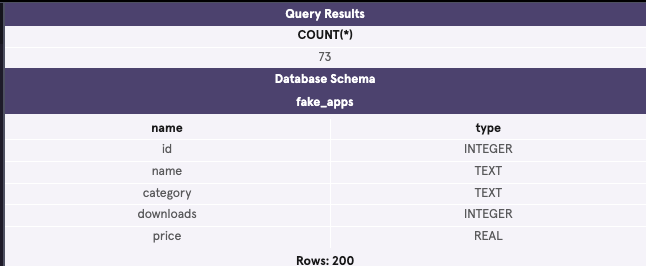
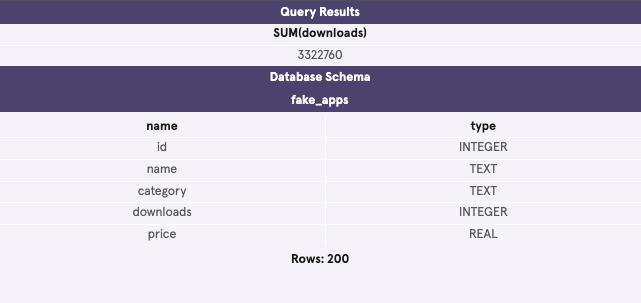
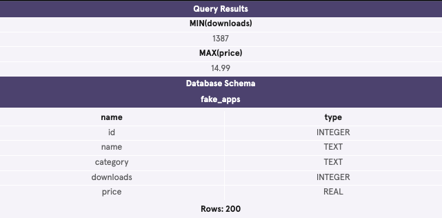
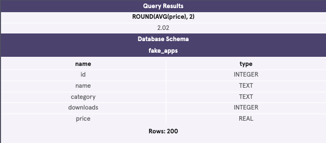
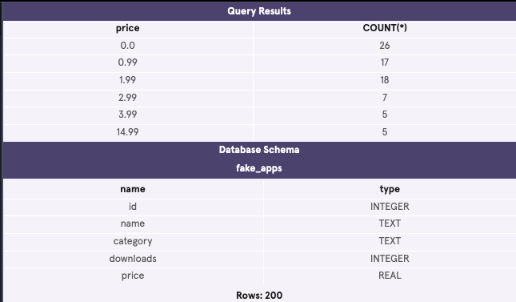
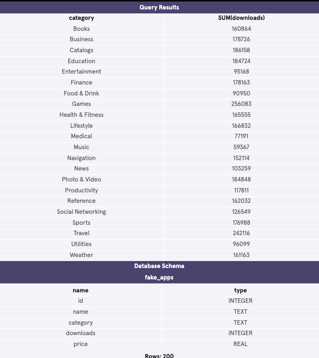
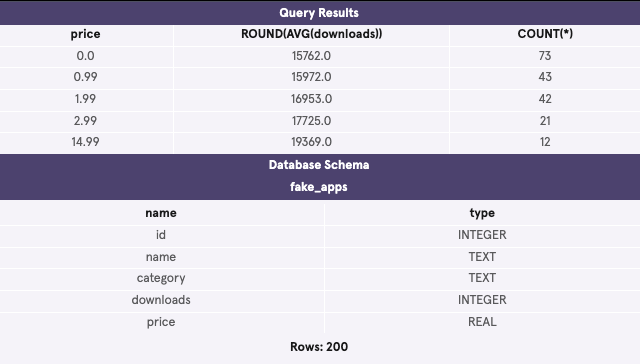

    SELECT *
    FROM fake_apps;

COUNT() is a function that takes the name of a column as an argument and counts the number of non-empty values in that column.

    SELECT COUNT(*)
    FROM fake_apps
    WHERE price = 0;

SUM() is a function that takes the name of a column as an argument and returns the sum of all the values in that column.

    SELECT SUM(downloads)
    FROM fake_apps;

MAX() takes the name of a column as an argument and returns the largest value in that column. Here, we returned the largest value in the downloads column.
MIN() works the same way but it does the exact opposite; it returns the smallest value.

    SELECT MIN(downloads)
    FROM fake_apps;

    SELECT MAX(price)
    FROM fake_apps;

The AVG() function works by taking a column name as an argument and returns the average value for that column.

    SELECT AVG(price)
    FROM fake_apps;

ROUND() function takes two arguments inside the parenthesis:
1. a column name
2. an integer

    SELECT name, ROUND(price, 0)
    FROM fake_apps;

    SELECT ROUND(AVG(price), 2)
    FROM fake_apps;

GROUP BY is a clause in SQL that is used with aggregate functions. It is used in collaboration with the SELECT statement to arrange identical data into groups. The GROUP BY statement comes after any WHERE statements, but before ORDER BY or LIMIT.

    SELECT price, COUNT(*)
    FROM fake_apps
    WHERE downloads > 20000
    GROUP BY price;

    SELECT category, SUM(downloads)
    FROM fake_apps
    GROUP BY category;

    SELECT category,
       price,
       AVG(downloads)
    FROM fake_apps
    GROUP BY 1, 2;

HAVING is very similar to WHERE. In fact, all types of WHERE clauses you learned about thus far can be used with HAVING. THE HAVING statement always comes after GROUP BY, but before ORDER BY and LIMIT.

    SELECT price,
       ROUND(AVG(downloads)),
       COUNT(*)
    FROM fake_apps
    GROUP BY price
    HAVING COUNT(*) > 10;

