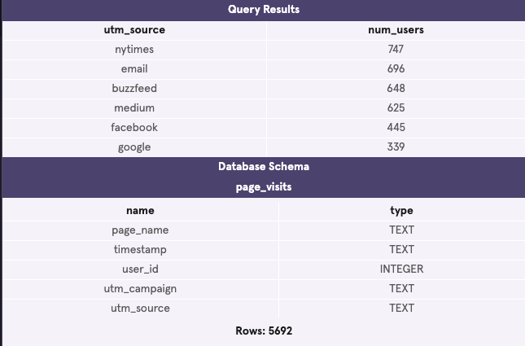

# Exploring Data with SQL

### This code will select all (*) columns from browse for the first 10 records.

    SELECT *
    FROM browse
    LIMIT 10;

#### Output:


#### This codes combines data from three different tables:

 - ```browse``` - gives the timestamps of users who visited different item description pages
 - ```checkout``` - gives the timestamps of users who visited the checkout page
 - ```purchase``` - gives the timestamps of when users complete their purchase

#### Using SQL, she finds that 24% of all users who browse move on to checkout. 89% of those who reach checkout purchase.

    SELECT ROUND(
      100.0 * COUNT(DISTINCT c.user_id) /
      COUNT(DISTINCT b.user_id)
    ) AS browse_to_checkout_percent,
    ROUND(
      100.0 * COUNT(DISTINCT p.user_id) /
      COUNT(DISTINCT c.user_id)
    ) AS checkout_to_purchase_percent
    FROM browse b
    LEFT JOIN checkout c
     ON b.user_id = c.user_id
    LEFT JOIN purchase p
     ON c.user_id = p.user_id;

#### Output:


### The following code runs a churn rate analysis, which is the percent of subscribers to a service who have canceled their subscription.

    SELECT COUNT(DISTINCT user_id) AS enrollments,
    	COUNT(CASE
           	WHEN strftime("%m", cancel_date) = '03'
            THEN user_id
      END) AS march_cancellations,
     	ROUND(100.0 * COUNT(CASE
           	WHEN strftime("%m", cancel_date) = '03'
            THEN user_id
      END) / COUNT(DISTINCT user_id)) AS churn_rate
    FROM pro_users
    WHERE signup_date < '2017-04-01'
    	AND (
        (cancel_date IS NULL) OR
        (cancel_date > '2017-03-01')
      );

#### Output:


### This code shows us how many visits come from each utm_source.

    SELECT utm_source,
     COUNT(DISTINCT user_id) AS num_users
    FROM page_visits
    GROUP BY 1
    ORDER BY 2 DESC;

#### Output:

